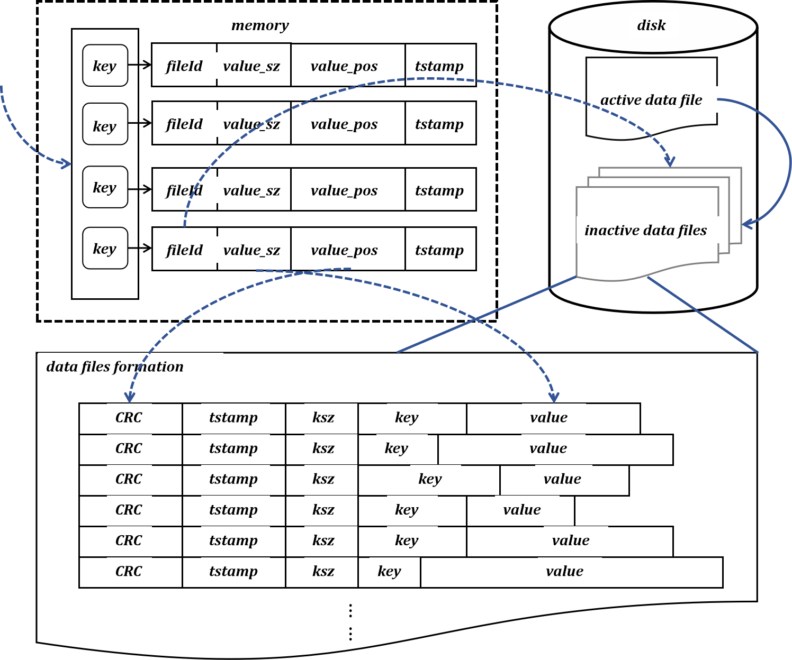
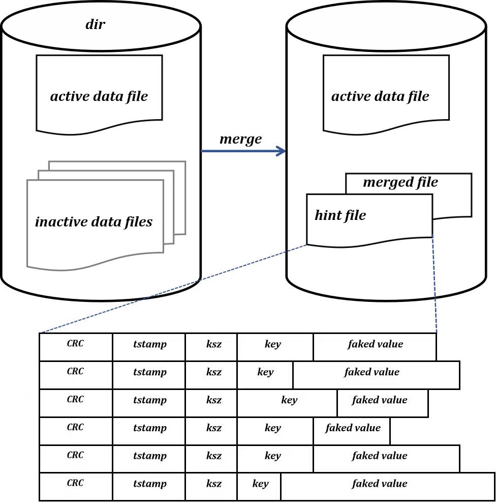
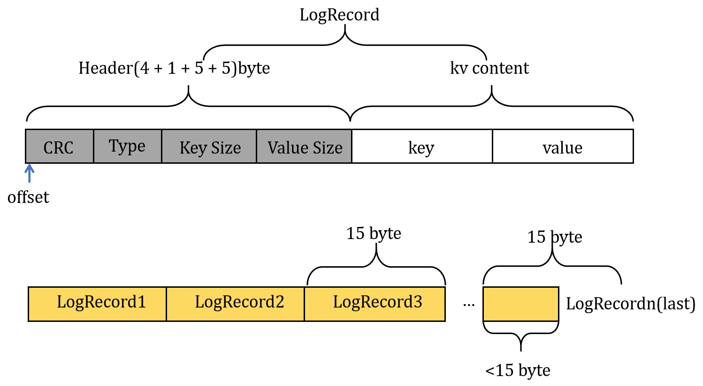

# 云原生架构下多智能体协作框架以及多智能体运维原型设计

---

## 项目目标

- 缩小平台工程师与开发人员的鸿沟，能够让开发工程师通过自然语言部署与运维应用，可以直接利用云原生集群的能力。
- 帮助运维工程师快速完成较为复杂任务的部署。比如mysql等，提高云原生工程师的工作便捷与效率
- 可以通过webhook监控集群数据，对于一些崩溃的应用，智能体能够读取日志内容并尝试修复较为简单的问题，提高应用的可恢复性。而不只是按照k8s的策略不断对应用进行重启
- 本系统暂时的设计受众是小型的开发团队对于大型团队功能需要进一步加强
- 对未来的期待：时候可以让agent系统控制一个数据中心从而打通软件工程从需求分析=> 资源部署 => coding => 应用部署 => 后期维护的全流程？从而实现软件开发完全由多智能体系统取代？权当(｡･∀･)ﾉﾞ自嗨

---

## 项目阶段

1. **专用于记忆存储的基于bitcask数据模型的kv数据库内核开发**

2. **针对运维/复杂环境下的多智能体框架探索**
3. **在云原生下的多智能体协作架构与框架适配**
4. **多智能体运维系统的搭建**
5. **云原生环境下的部署简化以及集群K8S兼容**

---

## 第一阶段:基于bitcask的NoSql数据库内核—ComDB

### 概述

​	ComDB是为了适配多智能体的记忆存储与搜索而开发的，基于bitcask数据模型的KV数据引擎。bitcask论文地址：[bitcask-intro.pdf](https://riak.com/assets/bitcask-intro.pdf)

常见的kv存储引擎有B+ 树，LSM树等。B+树的常见代表BoltDB，而LSM树则有著名的levelDB还有RocksDB。本数据库的常见操作是完全按照bitcask论文进行复现的并且为了适应智能体的搜索功能，我在数据库系统层集成了搜索的功能以支持智能体高效搜索记忆空间。

​	数据库需要支持：

* 读写低延迟
* 在面对大量随机写入的高吞吐量
* 能够处理超过内存容量的数据
* 可以保证快速恢复并且具备备份功能
* 能够具备高效的搜索功能

---


### 数据模型详述

​	bitcask的数据模型相比与LSM tree和B + tree是非常简洁易懂的。



bitcask架构如上图：

* 内存索引：数据库首先需要在内存中维护一个key的索引表（**keydir**），这个地方的做法其实是参照inode这个结构进行设计，思维是比较像的，每一个key都会维护一个对应的数据项，数据项的内容包括文件ID，value的偏移（size），value在files中的位置，时间戳。数据库进程通过fileId（文件名）去找对应的数据文件。
* 磁盘设计：bitcask实例的本质其实就是文件系统上的一个目录。我们将在目录中的数据文件分为了两类：活跃数据文件和非活跃数据文件。我们限制每次**只有一个进程**能进入目录（锁），写操作只能在活跃进程上进行，这保证了IO是**顺序执行**的，而不会在很多磁盘块间跳，减少了磁盘的寻址时间。当写操作到达一个阈值的时候就会将活跃数据文件追加到非活跃数据文件集合中。所以对于bitcask实例本质上是包含一个活跃可写数据文件和非活跃数据文件集合的目录
* 数据文件：上面为每一条数据的组织格式：
  + CRC：后面数据分布的校验码（从时间戳 -> value ）
  + tstamp：时间戳
  + ksz：键的大小
  + key：键
  + value：值




* 读写设计： 每次的写入操作是追加到活跃文件之中的，删除操作实际上并不会真实的删除文件而也是一个追加操作，会往文件中写入一个特殊的**墓碑值**，用于标记一条记录的删除（类似逻辑删除）。在merge中才会删除数据。
* merge过程：由于非活跃数据文件会一直保留在磁盘中，我们没有将旧的数据删掉，为了避免数据爆炸，bitcask原文中提出了merge的操作来删除无效数据。merge会遍历所有的旧数据文件，将所有的数据重新写入新的数据文件中，同时删除无效数据文件。
* hint文件：merge完成之后会为merge file生成一个hint file。hint文件与数据文件并没有格式上的区别，只是hint文件中的value字段并不存储value值而是value的索引。hint文件的作用是快速构建索引，而不用去加载全部的数据文件。

​	其实bitcask这个数据模型和LSM树是很像的，整体的思维很像。LSM树是在内存中先进行数据的累计，累计到一定程度之后使用WAL转化到磁盘中进行持久化存储。LSM的merge操作称为compaction。分为compact和level，这里不详细描述了。

---

​

### 磁盘内存设计

#### 内存设计

​	在内存中我需要实现一个能够支持快速插入，查找，删除的数据结构，可以选择红黑树、BTree、跳表之类的数据结构。在本系统中内存中使用跳表来组织数据，这里使用别人的轮子：Google的BTree库。为了后续可以形成较为方便的插拔模块，此处使用通用抽象接口便于后续可以使用。后续还会接入自适应基数树与跳表作为内存索引的承载。

```go
// Indexer 内存抽象接口定义
type Indexer interface {
	// Pur put向索引中存储的key对应的数据位置信息
	Put(key []byte, pos *data.LogRecordPos) bool
	// Get 根据key取出信息
	Get(key []byte) *data.LogRecordPos
	// Delete 删除信息
	Delete(key []byte) bool
}
```


#### 磁盘设计

​	这里其实只需要注意追加写就ok了就是简单的操作系统的操作封装。

```go
type IOManager interface {
	// Read 从文件中读取数据
	Read([]byte, int64)
	// Write 写入字节数据到文件中
	Write([]byte) (int, error)
	// Sync 持久化数据
	Sync() error
	// Close 关闭文件
	Close() error
}
```

#### 读写流程

​	整个读写流程其实就是设计到下面的几个对象:

```go
type DB struct { // bitcask数据库实例
	mu         *sync.RWMutex
	activeFile *data.DataFile            // 当前活跃文件
	olderFile  map[uint32]*data.DataFile //  非活跃文件-> 只用于读
	options    Options // 用户的配置信息
	index      Indexer // 内存索引的操作接口
}
```

```go
type DataFile struct {
	FileId    uint32        // 文件id
	WritOff   int64         //偏移
	IOManager fio.IOManager // 对文件进行实际的读写操作

}
```

```go
type LogRecord struct { // ---> 数据文件中数据的格式
	Key   []byte
	Value []byte
	Type  LogRecordType // 用于标记该数据是正常值还是墓碑值
}

type LogRecordPos struct { // ------> 内存索引格式
	Fid    uint32
	Offset int64
}
```

下面说一下大概的写流程：

```
step1: initialize active file
step2: if activefile.size()+current_logrecord.size() > threhold
	=> sync the kernel buffer
	=> activefile to oldfileSet[fileId]
step3: Write the logrecord into the datafile
step4: return the pos of memory index

```

几个细节需要注意

* 是活跃文件 + 当前记录的size大于阈值才会触发数据文件状态的转化
* 在转化的时候需要先将活跃文件中的数据持久化
* 加锁的问题需要小心，Google的BTree库自带锁所以内存索引更新可以不加锁，但是写datafile的时候一定需要加锁

---

### 数据库启动以及基础操作流程

#### 数据库启动流程

主启动程序:

* step1:  对用户传入的配置文件进行校验
* step2: 判断用户传入的实例目录是否存在
* step3: 初始化DB实例
* step4: 加载数据文件
* step5: 通过数据文件加载内存索引

加载数据文件：

* step1: 遍历数据目录下的所有的文件，此处设计数据文件的格式为00001.data的形式
* step2: 将目录下的文件名给拆出来，构建文件ID数组
* step3: 对文件ID进行排序
* step4: 区分文件中的活跃文件与非活跃文件, 注：活跃文件为ID最大的数据文件，其余为活跃文件

构建内存索引：

* step1: 遍历所有的数据文件中每一项LogRecord，并构建LogRecordPos及内存索引项。
* step2: 判断索引项是否为被删除的墓碑值，若为墓碑值则将其从索引中删除
* step3: 更新偏移量令其指向下一个LogRecord
* step4: 当前的文件是活跃文件，需要更新活跃文件的索引, 此处的索引是最新的索引。

#### 数据文件读写与LogRecord编码



* Header：头部信息包括CRC校验和，Type类型，KeySize键大小，ValueSize值大小。我们在读取数据的时候会先读取固定长度的头部Header以获取键值的大小。key Size 与Value Size是全为变长的，所以这个地方我们设置了一个Header固定读取长度（设置为15字节），反序列化的时候如果存在多余的字节就会被忽略，这样设计是为了节省磁盘的空间。
* 注意事项：使用固定的长度的头部读取方式在最后一个LogRecord读取的时候可能会出现对齐问题，此处的logRecord的读取需要注意一下。从后往前的找到这个位置的头部偏移。

* 流程：使用文件offset定位LogRecord => 根据头部的内容进行CRC校验验证文件是否损坏=> 根据头部进行kv content的定位并读出kv => 封装为LoRecord结构返回

---

### Close、Sync、迭代器

#### 迭代器Iterator

​	为了用户可以更加方便的对数据进行方法，本数据库实现了基础的迭代器。我们对迭代器进行了两层的封装。1. 系统级别面向索引的迭代器。2.面向用户的迭代器。

* 面向索引的迭代器

```go
type Iterator interface {
	Rewind()                   // 重新回到迭代器起点
	Seek(key []byte)           // 根据传入的key查找到第一个大于或者小于等于目标Key，从这个Key开始遍历
	Next()                     // 跳转到下一个key
	Valid() bool               // 是否有效，即是否已经遍历完所有的key
	Key() []byte               // 当前遍历位置的Key数据
	Value() *data.LogRecordPos // 当前遍历位置的value数据
	Close()                    // 关闭迭代器释放资源
}

type BtreeIterator struct {
	currIndex int     // 当前的位置
	reverse   bool    // 是否为反向的遍历
	values    []*Item // key 位置索引的信息
}
```

​	为了适配多种不同类型的索引类型，我们需要先定义一个统一的抽象迭代器接口以适配不同类型索引。如果使用B树作为索引，我们需要在B树的基础上再次对索引迭代器进行封装。这里初始化的内容有些不一样需要将树的结构转化到数组中以满足我们对迭代器的需要

```go
func NewBtreeIterator(tree *btree.BTree, reverse bool) *BtreeIterator {
	var idx int
	values := make([]*Item, tree.Len())
	// 将所有的数据都放到Values数组里面去
	saveValues := func(it btree.Item) bool {
		values[idx] = it.(*Item)
		idx++
		return true
	}
	if reverse {
		tree.Descend(saveValues)
	} else {
		tree.Ascend(saveValues)
	}
	return &BtreeIterator{
		currIndex: 0,
		reverse:   reverse,
		values:    values,
	}
}
```

​	此处初始化其实是有一些缺陷的，由于是直接使用别的的库所提供的方法无法符合我们对迭代器的要求，所以我们需要把树中的内容加载到数组中，这样其实是会导致内存膨胀比较快。具体上方的接口实现此处不表。

* 用户迭代器接口

  ```go
  type Iterator struct {
  	indexIter index.Iterator
  	db        *DB
  	options   IteratorOptions
  }
  type IteratorOptions struct {
  	// 遍历前缀为指定前缀的Key
  	Prefix []byte
  	// 是否可逆
  	Reverse bool
  }
  ```

​	用户迭代器其实是对内存索引迭代器的进一步封装，使其对用户更加友好。在此基础上为了满足后续检索的需要，这里添加了对前缀的适配。后续可以在迭代器层面添加搜索功能，让智能体能够操作迭代器进行记忆空间检索。前缀功能的实现，这只是一个范例，查找的方法都要加上这个前缀的匹配：

```go
// Rewind 回到初始位置
func (it *Iterator) Rewind() {
	it.indexIter.Rewind()
	it.skipToNext()// -> 		if prefixLen < len(key) && bytes.Compare(key[:prefixLen], it.options.Prefix) == 0 这个函数其实就是实现了一个前缀对比，如果前缀不符合就控制currIndex不断的调到Next数组上
}
```

​		两个封装的方法用于在数据库层增强用户的体验：

```go
// ListKey 将所有Key给列出来
func (db *DB) ListKeys() [][]byte
// Fold 对数据库中的所有的数据进行指定的操作，只要用户传入bool=True，Fold就会遍历所有数据执行fn
func (db *DB) Fold(fn func(key []byte, value []byte) bool) error
```

#### Close、Sync

​	这个比较简单就不需要太多解释了

```go
func (db *DB) Close() error {
	// 关闭当前的活跃文件
    // 遍历关闭所有的非活跃文件
}

// Sync 持久化活跃文件
func (db *DB) Sync() error 
// 这里需要注意！在数据库层的操作一定要注意加锁！不然会出大事
```

---


### WriteBatch以及事务支持


---

### Merge操作

---


### 内存索引、IO的优化


------

### 数据备份、HTTP Server、benchmark测试


---

### Redis格式支持


------------------

### 搜索算法与实现

------------------

### Raft共识算法

------------

### Sharking分片


