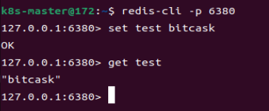

# ComDB - A NoSQL Database Based on Bitcask Model

## Overview

​	ComDB is a key-value storage engine based on the Bitcask data model, designed for memory storage and search in multi-agent systems. It provides high-performance read/write operations, low latency, and high throughput, supporting data processing beyond memory capacity. ComDB also integrates search functionality to enable efficient memory space search for agents.

​	The author's capabilities are limited, and this database is primarily a learning project. Many features are still under development and not fully refined. For instance, while the merge operation has been implemented, it currently lacks automated scheduled cleanup. Additionally, the transaction serialization mechanism is relatively simplistic, resulting in limited transaction throughput. Furthermore, numerous functionalities have not undergone thorough testing. Therefore, please avoid using this database in critical production environments. Ongoing improvements and enhancements will be made over time.

[document](https://github.com/cheng-zhangpei/ComDB/tree/main/doc/doc.md)

## Features

- **High Performance**: Low-latency read/write operations and high throughput.
- **Memory Efficiency**: Handles data larger than memory capacity.
- **Search Integration**: Built-in search functionality for efficient memory space search.
- **Redis Compatibility**: Supports Redis data structures (String, Hash, Set, List, ZSet, Bitmap) and RESP protocol.

## Prerequisites

- Go 1.16 or higher.
- Linux environment (recommended for deployment).

## Getting Started

### Redis Support

```sh
git clone https://github.com/cheng-zhangpei/ComDB.git
cd ComDB/main
./main
```

​	it will open a server which support data operations by redis-cli or redis SDK in different lanuages

if you install redis-cli, you can test the function easily



#### Http Server

```sh
git clone https://github.com/cheng-zhangpei/ComDB.git
cd ComDB/http
./http
```

​	it will open a http server for some data operation. you can see the doc for details.[document](https://github.com/cheng-zhangpei/ComDB/tree/main/doc/doc.md)

#### Example For Developer

```go
import (
	"ComDB"
	"fmt"
)

func main() {
	opts := ComDB.DefaultOptions
	opts.DirPath = "/tmp/bitcask-go"
	db, err := ComDB.Open(opts)
	if err != nil {
		panic(err)
	}
	err = db.Put([]byte("name"), []byte("bitcask"))
	if err != nil {
		panic(err)
	}
	val, err := db.Get([]byte("name"))
	if err != nil {
		panic(err)
	}
	fmt.Println(string(val))
}
```

